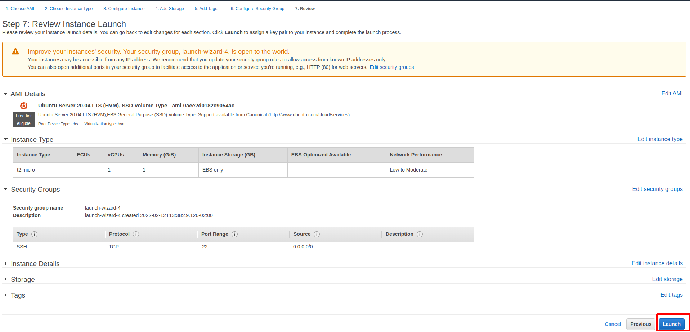

# Web Stack Implementation (LEMP Stack)
In Project 1, Webstack Implementation (LAMP Stack) uisng AWS was considered. 
Link to project 1 : https://github.com/topyo/Webstack-Implementation. 
In Project 2, we will be considering the LEMP Stack Implentation using AWS. This project follows similar concept as Project 1.

## What is a LEMP?
LEMP is a deviation of the ubiquitary LAMP stack used for developing and deploying web applications.Generally, LAMP consists of Linux, Apache, MySQL, and PHP. Due to its flexibility, the components can easily be switched. With LEMP, Apache is replaced with the lightweight yet powerful Nginx.

## Naming / Pronounciation Convention
LEMP is used due to the pronunciation for Nginx: Engine-X (en-juhn-ecks). Think of this, In English, the article an is used instead of a for hour even though it begins with a consonant. The importance is the sound of the first letter rather than its written representation. Besides, LEMP is actually pronounceable and doesn’t sound like reciting the alphabet (LEMP, 2021). The term LEMP is an acronym that represents L for the Linux Operating system, Nginx (pronounced as engine-x, hence the E in the acronym) web server, M for MySQL database, and P for PHP scripting language.

## LEMP Stands For:
## L- Linux Operating System
## E- Nginx Server
## M- MySQL Database
## P- PHP
## Linux
Linux is an open source Unix-like operating system . It provides the base for the stack components and many distributions including package management systems that make installing the desired applications easy. However, these repository versions will generally not be the most current. Two of the most commonly used Linux distributions in LEMP stacks are Debian and Ubuntu (LEMP,2021)MAP protocols. It also functions as a load balancer, HTTP cache, and web server (origin server). It has a strong focus on high concurrency, high performance and low memory usage. The HTML5 Boilerplate project has sample server configuration files to improve performance and security (LEMP, 2021)

## MySQL

MySQL is the second most widely used open source relational database management system. A community-developed fork, MariaDB, is led by the original developers. It aims to be a drop-in replacement (LEMP, 2021)

## PHP
PHP is a server-side scripting language designed for web development. The scripting role can also be filled with Python or Perl. Servers such as Gunicorn or uWSGI can be used in conjunction with Nginx to serve these applications (LEMP, 2021)

# LEMP Implementation using AWS 
A major prerequsite for completing this project is having an AWS account. For new users, here is the link to create an AWS account. 
## AWS Account
To create an AWS account, please use the link 
https://aws.amazon.com/account/sign-up

For video tutorial on how to create an AWS account
https://www.youtube.com/watch?v=v3WLJ_0hnOU.

Since I have created an AWS account ealier, process was shown in project 1M user is the best practice https://docs.aws.amazon.com/IAM/latest/UserGuide/introduction.html)

## L- Linux Operating System
The L in LEMP is Linux. This is the operating system for this stack and this will be installed by launching an EC2 instance with ubuntu as the flavor. The following the steps is use

3. Choose an Amazon Machine Image
For this project, we will be using the Ubuntu Server 20.04 LTS (HVM), SSD Volume Type - ami-0aee2d0182c9054ac (64-bit x86) / ami-04e842c4cdd82c62e (64-bit Arm) the Amazon Machine Image (AMI)

4. Choose Instance type

5. Lauch 

#### Note 

Before a virtual server is lauched, a key pair must be generated and downloaded. A key pair consists of a public key that AWS stores, and a private key file that users store. Together, they allow users to connect to their instance securely. For Windows AMIs, the private key file is required to obtain the password used to log into the instance. For Linux AMIs, the private key file allows users to securely SSH into their instance. Amazon EC2 supports ED25519 and RSA key pair types.(Amazon, 2022).
*The key is very important- Please save the downloaded private key (.pem file) secIn this project we have built a flexible foundation for serving PHP websites and applications to websvisitors,urely and do not share it with anyone! Connection to the server will never be possible again if it is lost!

For this project,I used my existing key pair and acknowledged that I had access to the key

6. Launch Status

## Connecting to EC2 Instance
After launching the EC2 Instance on AWS, it is essential to connect to the EC2 Instance via terminal. The steps below is used to achieve the connection  
1. Type cd Downloads into the local PC linux terminal (This command allows a change of directory to where the downloaded PEM file is saved). 

##### Command : cd~/Downloads
2. Type $ sudo chmod 0400 < downloaded private-key-name>.pem ( This command changes the permissions for the private key(.pem) file)

Note: if this permisions are not changed an error called "Bad permissions" will be displayed. The anchor tags < > means the content in the anchor needs to be replaced by user. For example, using the above command, a user needs to replace the private key to the name it was saved with on their system during the earlier download. If the downloaded private key was saved/ named as Privatekey1.pem that means the above command will now be

sudo chmod 0400 Privatekey1.pem

3. Type ssh -i <Your-private-key.pem> ubuntu@<EC2-Public-IP-address>

On the local PC linux terminal, we have the below after completing the above steps

Following the above steps we now have the 
#### L- Linux Operating System component is installed.

## Installing the Nginx Web Server
The next component of the stack of is
# E- Nginx Server
Nginx [engine x] is an HTTP and reverse proxy server, a mail proxy server, and a generic TCP/UDP proxy server, originally written by Igor Sysoev.
### How Does Nginx Work?
Nginx is built to offer low memory usage and high concurrency. Rather than creating new processes for each web request, Nginx uses an asynchronous, event-driven approach where requests are handled in a single thread. With Nginx, one master process can control multiple worker processes. The master maintains the worker processes, while the workers do the actual processing. Because Nginx is asynchronous, each request can be executed by the worker concurrently without blocking other requests.

Some common features seen in Nginx include:

Reverse proxy with caching

IPv6

Load balancing

FastCGI support with caching
 
TLS/SSL with SNI

Nginx Web Server will display the web page to site visitor. We will be using the following command to get Nginx Web Server installed. 

Nginx can be installed using the Ubuntu's package manager ‘apt’
Step 1: Update the list of packages in package manager using the command

sudo apt update

Step 2: Run Nginx package installation with command 

sudo apt install nginx

Step 3: Verify if nginx is running as a Service in the OS with the command 

sudo systemctl status nginx

A green dot shows that the server is running and the webserver was correctly launched in the cloud.

und connection through port 80.

Open Port 80

The server is running and can be accessed locally from the Internet (Source 0.0.0.0/0 means ‘from any IP address’). The below command is used to check how it can be accessed locally in the Ubuntu shell.

$ curl http://localhost:80   
or 

$ curl http://127.0.0.1:80`

The above command typically produces same result, however, the first command accesses the server through the DNS name while the second command accessing the sever using an IP address (in this case IP address 127.0.0.1 corresponds to DNS name ‘localhost’ and the process of converting a DNS name to IP address is called “resolution”).

### Verification
After the port 80 is opened, the next step is to verify if  Nginx  server can recieve and respond to request from the internet. A IP address below was used for the verification http://99.79.60.244

The image below shows that the webserver is installed and accessible

### Good job! Now we have the LE components of LEMP stack installed 

We proceed now to install 
 
## M- MySQL Database 
 
MySQL is a relational database management system based on SQL – Structured Query Language. The application is used for a wide range of purposes, including data warehousing, e-commerce, and logging applications. The most common use for mySQL however, is for the purpose of a web database. MySQL Database Service is a fully managed database service to deploy cloud-native applications and it is used within the PHP environment. Now that a webserve is running,a database management system is required for storing and managing data.

#### Step 1: MySQL can be installed by using the code

sudo apt install mysql-server

The above code is used to get and install mysql software
When prompted, confirm installation by typing Y, and then ENTER.

#### Step 2: Running Security Script
Best prectice after installation of mysql software is for security script to be run. The code 

$ sudo mysql_secure_installation

installs the security script and removes some insecure default settings and lock down access to the database system. 

##### N.B While running the script,
VALIDATE PASSWORD PLUGIN is asked.Enabling this feature subjective. If enabled, passwords which don’t match the specified criteria will be rejected by MySQL with an error. However, It is safe to leave validation disabled, but a strong and unique passwords should always be used for database credentials.

For other questions press Y and hit the ENTER key at each prompt.This removes some anonymous users, the test database, disable remote root logins, and load these new rules so that MySQL immediately will accept the changes made.

#### Step 3 Testing 

The command 

$ sudo mysql

is used to test if the database was installed properly and also to  test if MySQL consol can be logged into.

The ouput is 

#### Step 4  Exit MySql 
To exit MySQL the command used is 

mysql> exit

Wow! We now have the LEM components of the LEMP stack installed. 
Now we now install the last component 

## P- PHP

PHP is a popular general-purpose scripting language that is especially suited to web development.It is Fast, flexible and pragmatic, PHP powers everything from blogs to the most popular websites in the world. PHP is the component of the setup that will process code to display dynamic content to the end user. In addition to the php package, php-mysql, a PHP module that allows PHP to communicate with MySQL-based databases will be required. Also, libapache2-mod-php is needed to enable Apache to handle PHP files. Core PHP packages will automatically be installed as dependencies

To install PHP, 3 packages will be run at once using the command 

$ sudo apt install php libapache2-mod-php php-mysql

Enter Y when a prompt is asked for installation continuation and ENTER to confirm installation

#### Excellent Work! Now we have the LEMP stacked installed. Now we need to configure NGNIX to use PHP Processor

 Configuring Nginx to Use PHP Processor

### Configuring Nginx to Use PHP Processor
 Nginx web server can  be used  to create server blocks to encapsulate configuration details and host more than one domain on a single server.This is similar to virtual host in Apache.
 In this project, LEMPStack will be used as the domain

On Ubuntu 20.04, Nginx has one server block enabled by default and is configured to serve documents out of a directory at /var/www/html. While this works well for a single site, it can become difficult to manage if multiple sites are hosted. Instead of modifying /var/www/html, a new directory structure will be created within /var/www for the your_domain website, leaving /var/www/html in place as the default directory to be served if a client request does not match any other sites
The configuration steps includes

### Step 1: Create the root web directory for your_domain using
$ sudo mkdir /var/www/LEMPStack

### Step 2: Assign ownership of the directory with the $USER environment variable, which will reference your current system user using

$ sudo chown -R $USER:$USER /var/www/LEMPStack

### Step 3 :Open a new configuration file in Nginx’s `sites-available` directory using `nano`

`$ sudo nano /etc/nginx/sites-available/LEMPStack`

This will create a new blank file on the terminal and the code w. Paste in the following bare-bones configuration:

`#/etc/nginx/sites-available/projectLEMP

server {
    listen 80;
    server_name projectLEMP www.projectLEMP;
    root /var/www/projectLEMP;

    index index.html index.htm index.php;

    location / {
        try_files $uri $uri/ =404;
    }

    location ~ \.php$ {
        include snippets/fastcgi-php.conf;
        fastcgi_pass unix:/var/run/php/php7.4-fpm.sock;
     }

    location ~ /\.ht {
        deny all;
    }

}`

They code above means:

- `listen` — Defines what port Nginx will listen on. In this case, it will listen on port `80`, the default port for HTTP.
- `root` — Defines the document root where the files served by this website are stored.
- `index`— Defines in which order Nginx will prioritize index files for this website. It is a common practice to list `index.html` files with a higher precedence than `index.php` files to allow for quickly setting up a maintenance landing page in PHP applications. You can adjust these settings to better suit your application needs.
- `server_name` — Defines which domain names and/or IP addresses this server block should respond to i.e.
#### Point this directive to your server’s domain name or public IP address.
- `location /` — The first location block includes a `try_files` directive, which checks for the existence of files or directories matching a URI request. If Nginx cannot find the appropriate resource, it will return a 404 error.
- `location ~ \.php$` — This location block handles the actual PHP processing by pointing Nginx to the fastcgi-php.conf configuration file and the `php7.4-fpm.sock file`, which declares what socket is associated with `php-fpm`.
- `location ~ /\.ht`— The last location block deals with `.htaccess` files, which Nginx does not process. By adding the deny all directive, if any `.htaccess` files happen to find their way into the document root ,they will not be served to visitors.
### Step 4 Activate configuration by linking the config file from Nginx’s sites-enabled directory using the command:

$ sudo ln -s /etc/nginx/sites-available/projectLEMP /etc/nginx/sites-enabled/

### Step 5 : Test Configuration for Syntax error
Test for Sybtax error using the command 

$ sudo nginx -t

### Step 6: Disable default Nginx host that is currently configured to listen on port 80, for this run using the command

sudo unlink /etc/nginx/sites-enabled/default

### Step 7: Apply Changes using the command 
$ sudo systemctl reload nginx
The new website is now active, but the web root /var/www/projectLEMP is still empty. 
so we create an index.html file in that location so that we can test that the new server block works as expected using the command:

sudo echo 'Hello LEMP from hostname' $(curl -s http://169.254.169.254/latest/meta-data/public-hostname) 'with public IP' $(curl -s http://169.254.169.254/latest/meta-data/public-ipv4) > /var/www/LEMPStack/index.html

### Step 8: Website Verification
We open the website URL using the IP address

http://Public-IP-Address:80
http://<Public-IP-Address>:80

### We now have the LEMP stack fully configured. In the next steps, we’ll create a PHP script to test that Nginx is in fact able to handle .php files within your newly configured website.

## Testing PHP with Nginx
Now that the LAMP stack is completely installed and fully operational.Testing can be completed to validate that Nginx can correctly handle the  `.php` files off to the PHP processor.
This can be done by creating a test PHP file in the document root. 
To get this completed, A new file called `info.php` within the document root in the text editor isN.B : For privacy, the some contents in the page were covered

 was typed into the new file

### Accessing the webpage from the web browswer
The web page can be accessed using the domain name or public IP address that was set in the 
Nginx configuration file, followed by /info.php

`http://`server_domain_or_IP`/info.php`

N.B : For privacy, the some contents in the page were covered

## Retrieving data from MySQL database with PHP
Before we start retrieving data from MySQL data with with PHP,we will first create a test database with a simple "To do list" and configure access so Nginx website would be able to query data from the DB and display the query.
Note: The native MySQL PHP library mysqlnd doesn’t support caching_sha2_authentication at the time of completing this project therfore the default authentication method for MySQL 8 was used.
### Step 1 : connect to the MySQL console using the root account using the command

$ sudo mysql

### Step 2: Create a new database and run the following command from your MySQL console:

mysql> CREATE DATABASE `example_database`;

### Step 3: Create a new user and grant them full privileges on the database
The following command creates a new user named `example_user`, using mysql_native_password as default authentication method. We’re defining this user’s password as `password`, but this  should replaced to a secured password for security purposes

mysql>  CREATE USER 'example_user'@'%' IDENTIFIED WITH mysql_native_password BY 'password';
### Step 4: Give user permission to "example_database" database using the command:

mysql> GRANT ALL ON example_database.* TO 'example_user'@'%';

This will give "example_user" the full privileges over the "example_database" database, while preventing this user from creating or modifying other databases on your server.

Now exit the MySQL shell with:

`mysql> exit`
### Step 5: To test if the new user has the proper permissions, 
We log  in to the MySQL console again, this time using the custom user credentials:

`$ mysql -u example_user -p`

The `-p` flag in this command, gave the prompt for the password used when creating the `example_user` user. After logging in to the MySQL console, confirm that you have access to the `example_database` database using the command

`mysql> SHOW DATABASES;`

output

### Step 6 : Create a test table named todo_list. From the MySQL console, run the following statement:

CREATE TABLE example_database.todo_list ( mysql> item_id INT AUTO_INCREMENT, mysql> content VARCHAR(255), mysql> PRIMARY KEY(item_id) mysql> );

Note: Please type the above statment to prevent error output

Step 7 : Insert a few rows of content in the test table. You might want to repeat the next command a few times, using different VALUES:

`mysql> INSERT INTO example_database.todo_list (content) VALUES ("My first important item");`

To confirm that the data was successfully saved to your table, run:

`mysql>  SELECT * FROM example_database.todo_list;`
`mysql> INSERT INTO example_database.todo_list(content) VALUES ("My first Important Things to get completed in Six Months");`
`mysql> INSERT INTO example_database.todo_list(content) VALUES ("Attend Cloud Engineering Bootcamp");`
`mysql> INSERT INTO example_database.todo_list(content) VALUES ("Complete all Project");`
`mysql> INSERT INTO example_database.todo_list(content) VALUES ("AWS-SA Exam");`
`

To confirm that the data was successfully saved to your table, run:

mysql> SELECT * FROM example_database.todo_list;
And the output is shown below

After confirming that there is a  valid data in your test table, you can exit the MySQL console using the command

`mysql> exit`
### Create a PHP script that will connect to MySQL and query for your content. 

To create a new PHP file in the custom web root directory . We’ll use vi for that:

`$ vi/var/www/projectLEMP/todo_list.php`

 The below content was typed into the`todo_list.php` script:

`<?php
$user = "example_user";
$password = "password";
$database = "example_database";
$table = "todo_list";`
try {
  $db = new PDO("mysql:host=localhost;dbname=$database", $user, $password);
  echo "<h2>TODO</h2><ol>";
  foreach($db->query("SELECT content FROM $table") as $row) {
    echo "<li>" . $row['content'] . "</li>";
  }
  echo "</ol>";
} catch (PDOException $e) {
    print "Error!: " . $e->getMessage() . " ";
    die();
}`

It was saved and close the file when editing was completed.

The web page can be accessed on the web brower by visiting the domain name or public IP address configured for your website, followed by `/todo_list.php:`

`http://<Public_domain_or_IP>/todo_list.php`

Output from web browser 

# Summary 
This project presents a the development of a flexible foundation for PHP websites and application using using Nginx as web server and MySQL as database management system.
